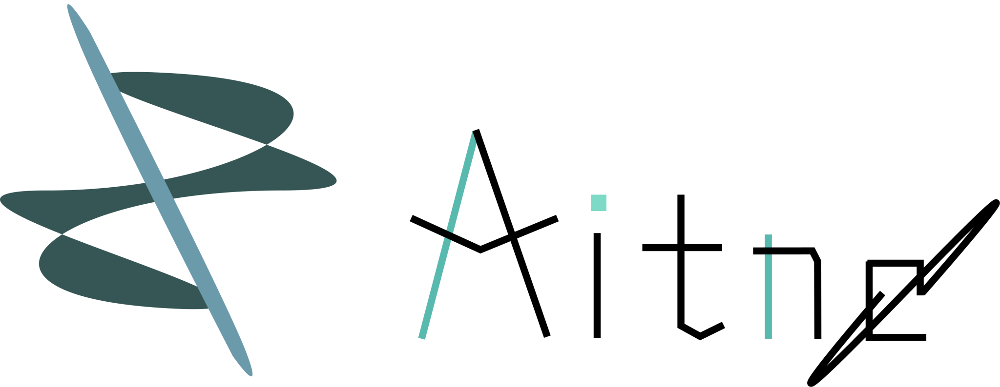

# Aitne



A lightweight, high-performance web framework built for modern frontend development, featuring fine-grained reactivity and a declarative component model. Inspired by [leptos](https://github.com/leptos-rs/leptos) and [solidjs](https://github.com/solidjs/solid). <br>
Supports MBX, a JSX-like component syntax, providing a familiar and expressive way to build reactive web applications.

## Getting Started

### Installing CLI

macOS/Linux:
```bash
curl -fsSL https://raw.githubusercontent.com/Arcelyth/aitne/main/scripts/install.sh | bash
```

*`aitne` CLI depends on moonbit async library which not supports Windows now*

### Initializing

```bash
aitne init your_project
cd your_project
```

Build your project:
```bash
aitne build
```

### Running

```
aitne run
```

This will start a web server on `http://localhost:8000` by default which depends on `eirene.toml` config file.

## Examples

Todo list: 
```moonbit
///|
fn todo_app() -> &View {
  let (input_val, set_input_val) = @reactive.create_signal("")
  let (todo, set_todo) = @reactive.create_signal(["Example."])

  let add_item = _ => {
    let text = input_val.get()
    if text != "" {
      set_todo.set(todo.get() + [text])
    }
    set_input_val.set("")
  }

  let remove_item = item => {
    let new_list = todo.get().filter(fn(t) { t != item })
    set_todo.set(new_list)
  }

  <div>
    <h1> Todo List </h1>
    <div>{() => todo.get().length().to_string() }</div>
    <div>
      <input 
        type="text" 
        value={input_val} 
        on:input={ev => set_input_val.set(event_target_value(ev))} 
      />
      <button on:click={add_item}> Add </button>
    </div>
    <ul>
      {for_node(() => todo.get(), item => {return item }, (item) => {
        <li>
          {() => item}
          <button on:click={_ => remove_item(item)}> "Delete" </button>
        </li>
      })}
    </ul>
  </div>

}
```

Simple router usage:
```mbx
///|
pub fn app() -> &View {
  <Router base="/">
    <Routes fallback={() => <NotFound />}>
        <Route path="/" view={() => <Home />} />
        <ParentRoute 
            path="/users" 
            view={() => <UsersPage />}> 
           <Route path="/:id" view={() => <UserDetailPage />}/> 
        </ParentRoute>
        <ParentRoute 
            path="/t"
            view={() => <TryPage />}> 
           <Route path="/t1" view={() => <TryPage />} /> 
        </ParentRoute>
    </Routes>
  </Router>
}

///|
fn main {
  let _ = @dom.mount_to_body(() => <App />)
}
```

## Editor Support
- [Neovim](https://github.com/aitne-dev/mbx.nvim)
- [Zed](https://github.com/aitne-dev/mbx-zed)
- [VScode](https://github.com/aitne-dev/vscode-mbx)

## Eirene

Eirene is a simple web server built in MoonBit, specifically designed to serve static assets and handle Single Page Application (SPA) routing fallbacks for the Aitne ecosystem. <br>
An example 'eirene.toml' config file:
```toml
[app]
name = "examples"
mode = "development"
entry_html = "index.html"

[build]
target = "js"
src_dir = "src"
out_dir = "."

[server]
host = "127.0.0.1"
port = 8000
```

## Learn more

[Book](https://aitne-dev.github.io/book) <br>
[API Document](https://mooncakes.io/docs/Arcelyth/aitne) <br>
[Benchmark](https://github.com/aitne-dev/js-framework-benchmark) <br>

*This library still work in progress, not production ready!*
